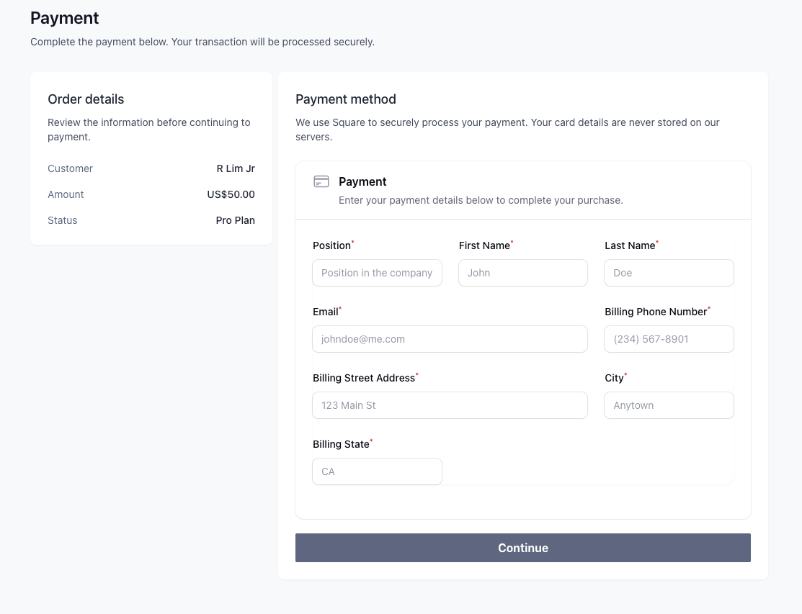
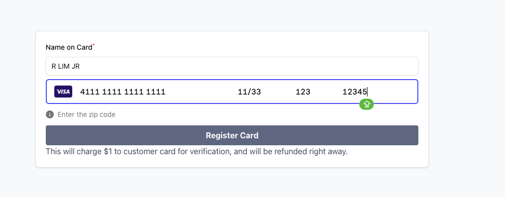

# Customer Walkthrough Guide

This guide provides a step-by-step walkthrough of the customer workflow for completing payment registration via the payment link sent by the agent. The walkthrough is based on the screenshots in the `Customer-payment-link` directory.

---

## Step 1: Receive Payment Link

**Context:** The customer receives the payment link from the agent via email and accesses the secure payment registration page.

**Key Elements:**
- Payment link received via email
- Secure link to access payment form
- Initial access to the payment registration interface

**Instructions:**
1. Open the email containing the payment link from the agent.
2. Click on the provided link to access the payment registration page.
3. Ensure you are on a secure connection (HTTPS) before proceeding.

---

## Step 2: Payment Details Entry

**Context:** The customer enters their credit card and payment information in the secure form provided through the payment link.

**Key Elements:**
- Secure credit card input fields
- Card number, expiration date, CVV, and billing information
- Validation and security indicators

**Instructions:**
1. Enter your credit card number in the designated field.
2. Provide the expiration date and CVV code.
3. Fill in any required billing address information.
4. Review all entered details for accuracy before submitting.

---

## Step 3: Confirmation and Completion

**Context:** The customer reviews the payment details and confirms the registration, completing the secure payment setup.

**Key Elements:**
- Summary of entered payment information
- Confirmation button to finalize registration
- Success message and next steps

**Instructions:**
1. Review the summary of your payment details.
2. Confirm that all information is correct.
3. Click the confirmation button to complete the payment registration.
4. Receive confirmation of successful registration and any follow-up instructions.
5. For the complete customer onboarding process including service agreements and ID verification, see [Customer Onboarding Walkthrough](./Customer.md).

---

## Workflow Summary

This customer workflow demonstrates the process for self-registering payment information via a secure link:

1. **Receive Link** - Customer receives and accesses the payment link
2. **Enter Details** - Provide credit card and billing information securely
3. **Confirm** - Review and finalize the payment registration

## Notes

- All screenshots were captured on February 5, 2026, between 11:23 PM and 11:24 PM
- The process ensures secure handling of payment information
- Real-time updates may be visible to the agent during this process

## For Developers

When implementing this workflow:
- Ensure end-to-end encryption for payment data
- Implement proper input validation and error handling
- Provide clear user feedback and confirmation messages
- Maintain security compliance standards (PCI DSS, etc.)
- Support multiple communication channels for link delivery

---

*Last Updated: February 9, 2026*